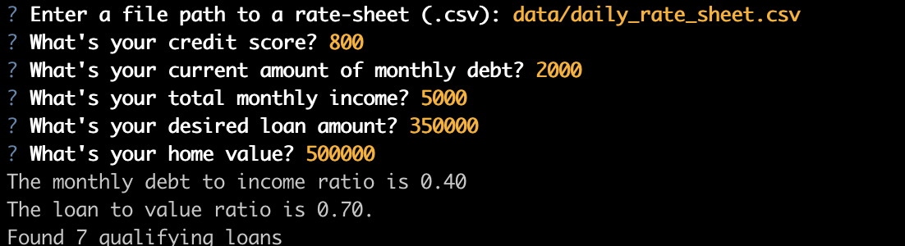
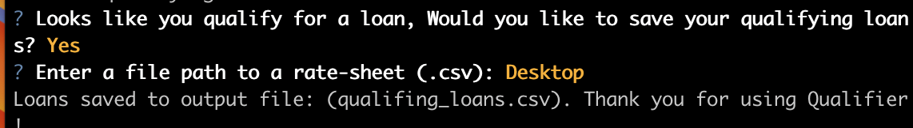
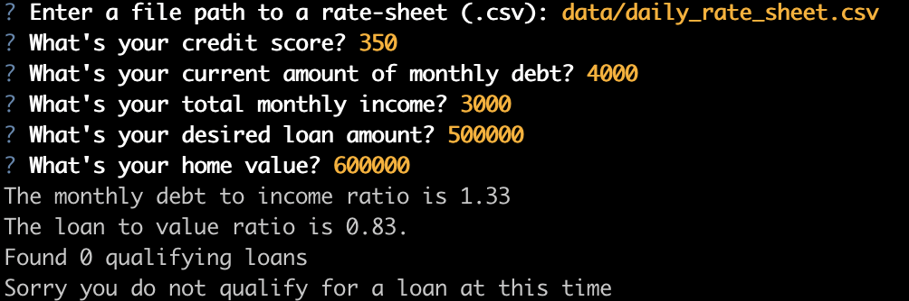
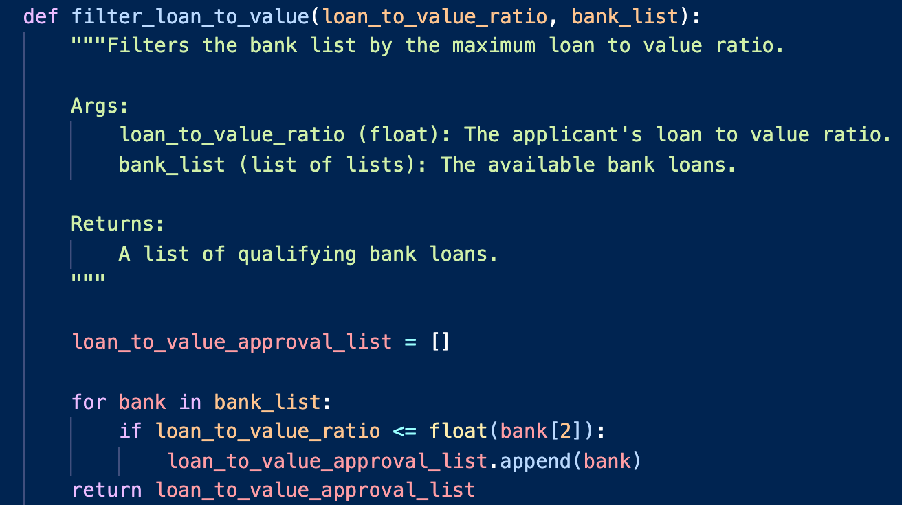
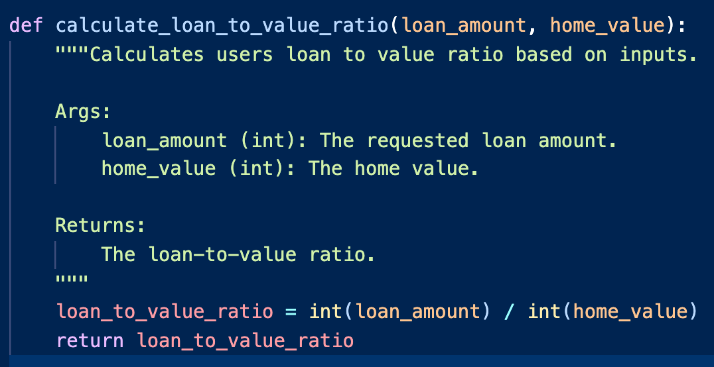

# Challenge Two Loan Application

The overarching goal I had for this project was to use the existing code that we created in class - and then add a real-world dialog/scenario to it to make it come to life.  This program runs a loan qualification process for potential home buyers and provides instant feedback to whether an individual qualifies for a loan, or not.  The program takes in information provided by the applicant and compares these credentials to current rates to see if there are any fits for a loan.  The user/applicant has the option to save their 'qualifying loans' as a new csv file so that they can have this information handy if they need it in the future.  And if they dont want to create a csv file of the loans, they can decline the option!     

---

## Technologies

This program uses the following Python (3.7) Libraries

* Path:
* Questionary
* Fire:
* sys:

I built and assembled this code in Visual Studios - The framework necessary to run/use this program is seen in my requirements.txt file.

```
conda environment_name create -f requirements.txt
```

---

## Installation Guide


Before using this program, make sure you install the following:

```python
  pip install fire
  pip install questionary
```

---

## Usage

This section should include screenshots, code blocks, or animations explaining how to use your project.

See the following Architecture structure to understand how program was built:

* app.py: This file is where the program lives
    * qualifiers:
        * filters: filters holds the filter variables that allow a decision to be made
        * utils: utils holds the program calculators and both the load & save csv functions

### User Examples

When running the application the user will get a handful of questions and responses like seen below. Depending on the user responses, outcomes will be different.






---


### Code Examples
Here are some exmples of the code I created which helped me create the program and allow it to function

**Loan to Value Filter.**
* This filter takes the applicants LTV information to see if it qualifies for any of the current loans offered.


**Loan to Value Calculator.**
* This is the LTV calculator which allows the program to filter it against offered loans.


## Contributors

Program created by Matthew Rudd - mprudd2@gmail.com - www.linkedin.com/in/matthewp-rudd
---

## License

MIT

